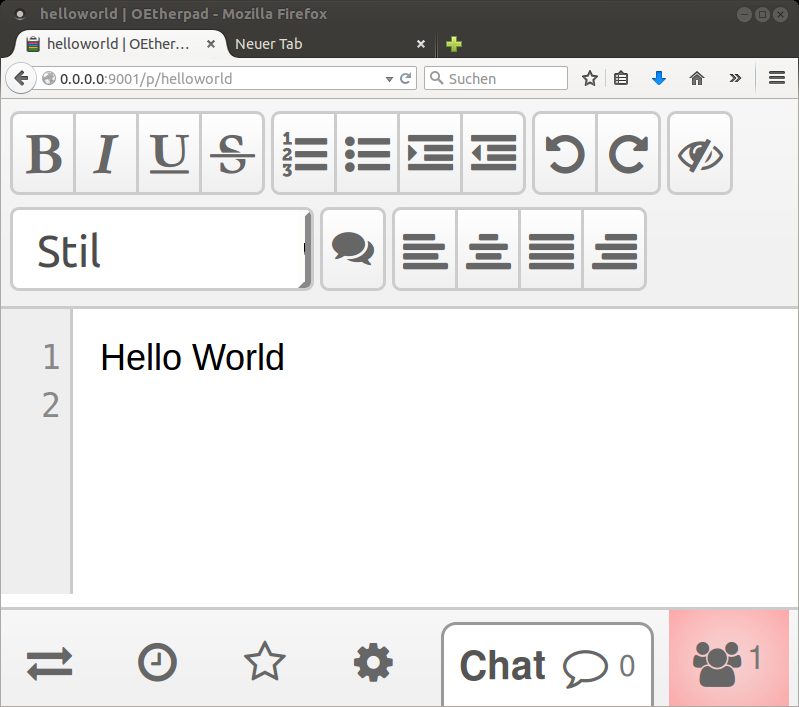
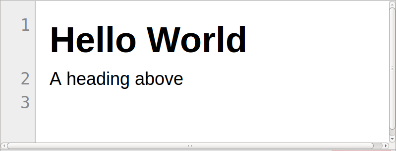
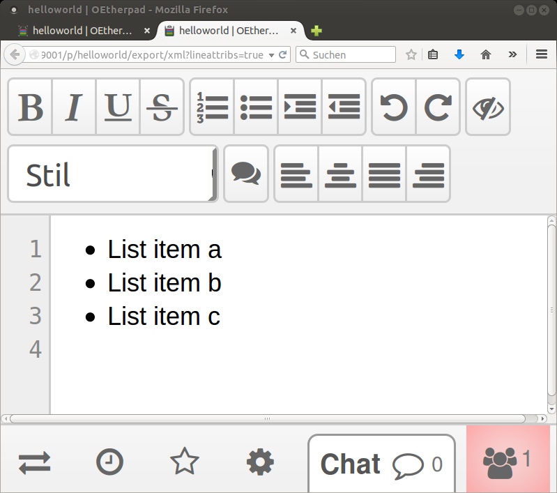

# XML Export for Etherpad Lite

This plug-in lets you export the content of a pad as XML. 

## Download and Install

Available on [github](https://github.com/stefanmintert/ep_xmlexport) and [npm](https://www.npmjs.com/package/ep_xmlexport)

1. Install etherpad lite (EPL)
2. cd to your EPL install direcory
3. npm install ep_xmlexport

## Usage

You can use the plug-in via a graphical UI or via HTTP API calls. 

## UI

The plug-in adds itself to the list of export formats. Choose `XML` from list of formats. 

You can't control the XML output format using the GUI. If you need something different than the default XML, use the HTTP API instead.

TODO: Make the default configurable. 

## HTTP API

### Request URIs

#### Basic call, requesting generic EPL XML

    http://<hostPort>/p/<padName>/export/xml

#### Choose pad revision, requesting generic EPL XML

    http://<hostPort>/p/<padName>/<revision>/export/xml

#### Control output of line attributes (handling of EPL line marker, lmkr), requesting extended EPL XML

    http://<hostPort>/p/<padName>/<revision>/export/xml?lineattribs=true

Removes the line marker (asterisk with attribute lmkr) from a line and adds all lmkr attributes as XML attributes to the `line` element. `key`/`value` become the name/value of the correpsonding line attribute.  

#### Control output of lists markup, requesting extended EPL XML

    http://<hostPort>/p/<padName>/<revision>/export/xml?lists=true

Generates `list` and `item` elements. 

#### Regex matching of URIs, requesting extended EPL XML

    http://<hostPort>/p/<padName>/<revision>/export/xml?regex=true

Generates markup for [URIs](http://www.ietf.org/rfc/rfc3986.txt). This feature is implemented because the original code, which this plug-in relies on, does a regex search for URIs; so I just kept this feature.

But the markup is generalized. For every URI in the pad text you'll get the following markup on export: `<matched-text key="uri" value="...">...</markup-text`. 

The generalized markup allows for an easy, later extension to match more patterns. 

### Response

#### MIME type and encoding

Currently the MIME type `plain/xml` is used. A switch to `application/xml` might be reasonable. 

Little is known about dealing with the correct encoding ([BOM, XML declaration, HTTP header](http://www.w3.org/TR/REC-xml/#charencoding)) in EPL. If you think I'm doing wrong, let me know (fork & PR appreciated).

#### Message body

The plug-in produces [well-formed XML](http://www.w3.org/TR/REC-xml/#sec-well-formed).

You have the choice of exporting *generic EPL XML* or *extended EPL XML* (non-generic). What does this mean?

##### Generic EPL XML (default)

The generic export mode simply translates every line of pad content into a `line` element in XML, and every pad attribute into an `attribute` element in XML. `attribute` *elements* carry `key` and `value` XML *attributes*. (Don't get confused: EPL attributes are transformed to XML elements named "attribute"; their key/values are transformed to XML attributes.) 

You can validate the generic EPL XML against the [epl.dtd](epl.dtd).

##### Extended EPL XML

The XML format changes if at least one of the output control parameters are set to `true`. How the format changes is described for each of the control paramaters, see above.

There's no only an experimental DTD for extended EPL XML: [epl-x.dtd](epl-x.dtd). Why experimental? Because the XML format changes with every new plug-in that introduces a new line marker attribute. BTW: The '-x' means "extended", not "experimental".

## Samples

### Plain text

The request

    http://<hostPort>/p/<padName>/export/xml

exports [helloworld.xml](./samples/helloworld.xml)

    <?xml version="1.0"?>
    <pad>
      <content>
        <line>Hello World</line>
        <line></line>
      </content>
    </pad>

### Heading

#### Generic EPL-XML

The request

    http://<hostPort>/p/<padName>/export/xml

exports [heading-generic.xml](./samples/heading-generic.xml)

    <?xml version="1.0"?>
    <pad>
      <content>
        <line><attribute key="heading" value="h1"><attribute key="insertorder" value="first"><attribute key="lmkr" value="1">*</attribute>Hello World</line>
        <line>A heading above</line>
        <line></line>
      </content>
    </pad>

#### Extended EPL-XML

The request

    http://<hostPort>/p/<padName>/export/xml?lineattribs=true

exports [heading-extended.xml](./samples/heading-extended.xml)

    <?xml version="1.0"?>
    <pad>
      <content>
        <line heading="h1" insertorder="first" lmkr="1">Hello World</line>
        <line>A heading above</line>
        <line></line>
      </content>
    </pad>

### Lists

#### Generic EPL-XML

The request 

    http://<hostPort>/p/<padName>/export/xml

exports [list-generic.xml](./samples/list-generic.xml)

    <?xml version="1.0"?>
    <pad>
      <content>
        <line><attribute key="insertorder" value="first"><attribute key="lmkr" value="1"><attribute key="list" value="bullet1"><attribute key="start" value="1">*</attribute>List item a</line>
        <line><attribute key="insertorder" value="first"><attribute key="lmkr" value="1"><attribute key="list" value="bullet1"><attribute key="start" value="2">*</attribute>List item b</line>
        <line><attribute key="insertorder" value="first"><attribute key="lmkr" value="1"><attribute key="list" value="bullet1"><attribute key="start" value="3">*</attribute>List item c</line>
        <line></line>
      </content>
    </pad>

#### Extended EPL-XML with lineattribs=true

The request

    http://<hostPort>/p/<padName>/export/xml?lineattribs=true

exports [list-lineattribs.xml](./samples/list-lineattribs.xml)

    <?xml version="1.0"?>
    <pad>
      <content>
        <line insertorder="first" list="bullet1" lmkr="1" start="1">List item a</line>
        <line insertorder="first" list="bullet1" lmkr="1" start="2">List item b</line>
        <line insertorder="first" list="bullet1" lmkr="1" start="3">List item c</line>
        <line></line>
      </content>
    </pad>

#### Extended EPL-XML with lists=true

The request

    http://<hostPort>/p/<padName>/export/xml?lists=true

exports [list-lists.xml](./samples/list-lists.xml)

    <?xml version="1.0"?>
    <pad>
      <content>
        <list type="bullet">
          <item>
            <line>List item a</line>
          </item>
          <item>
            <line>List item b</line>
          </item>
          <item>
            <line>List item c</line>
          </item>
        </list>
        <line></line>
      </content>
    </pad>

## Exporting Comments

Since version 2.0.0 EPL-comments are supported. The supported plugin is [ep_comments_page](https://www.npmjs.com/package/ep_comments_page). If installed, comments are exported along with their replies. There's no switch and no need to turn this feature on. But [jsxml](https://www.npmjs.com/package/jsxml) is required. It's listed as an optional dependency in package.json. If jsxml is not available, you won't get any comments in the exported XML.

## Legal Information

The work on this plug-in began as a fork of <https://github.com/edy/ep_latexexport>, which is available under an Apache license. 

It's now a project on it's own with significant changes. Furthermore I plan a major re-factoring of the current code.

My own part of work is available under the following license.

       Copyright 2015 Stefan Mintert
    
       Licensed under the Apache License, Version 2.0 (the "License");
       you may not use this file except in compliance with the License.
       You may obtain a copy of the License at
    
         http://www.apache.org/licenses/LICENSE-2.0
    
       Unless required by applicable law or agreed to in writing, software
       distributed under the License is distributed on an "AS IS" BASIS,
       WITHOUT WARRANTIES OR CONDITIONS OF ANY KIND, either express or implied.
       See the License for the specific language governing permissions and
       limitations under the License.

## Version history

### 2.0.0

* Added export functionality for [EPL comments](https://www.npmjs.com/package/ep_comments_page). Requires [jsxml](https://www.npmjs.com/package/jsxml)
* Incompatible change of XML export format. See DTD(s) for details. You have to update your code if you're processing the exported XML.

### 1.0.x

* First version
* Exports content of a Pad in XML.

